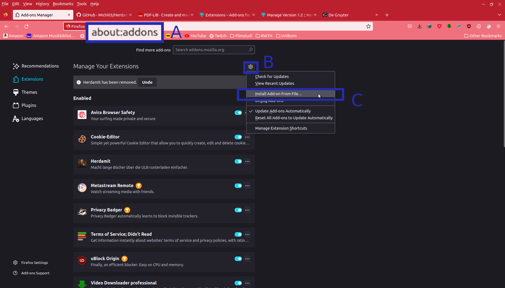
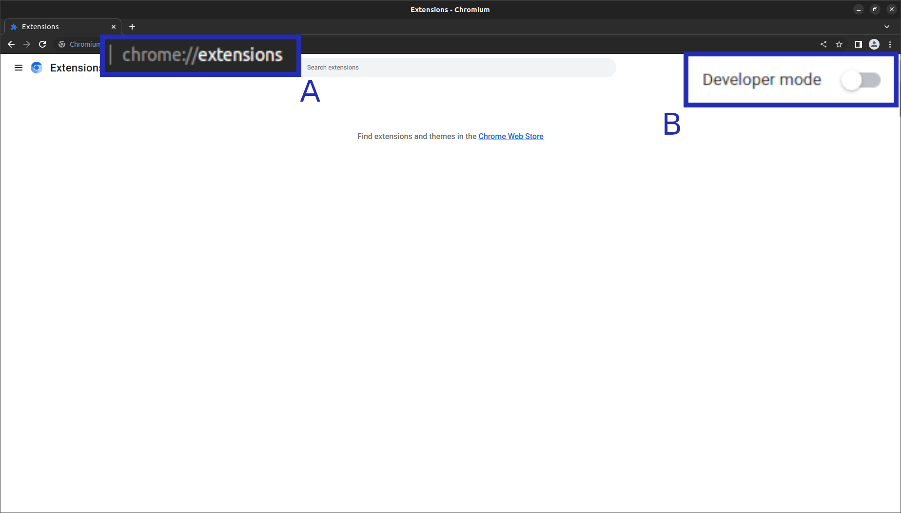
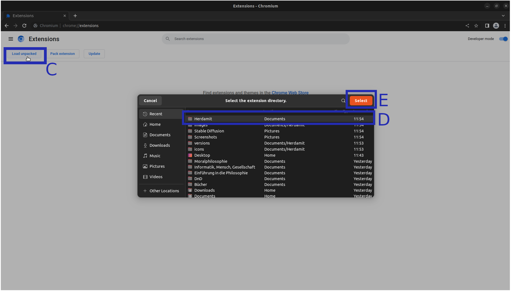
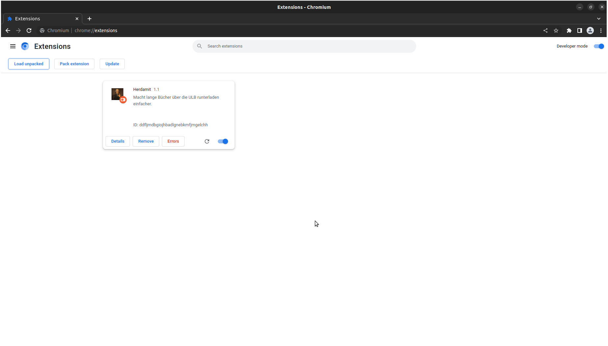

# Herdamit
Dieses kleine Programm ist dafür da, um das Herunterladen von Büchern im PDF-Format über besonder unkooperative Verläge (z.B. Felix Meiner) einfacher zu gestalten.
Hier werden sonst gewisse Umwege von den Studierenden gefordert, wie das Herunterladen einzelner Kapitel und anschließende manuelle Zusammenführen über PDF-Editoren.
Bis jetzt unterstützen wir die folgenden Verläge:

* [Felix Meiner Verlag](https://meiner-elibrary.de/)
* [De Gruyter](https://www.degruyter.com/)
* Ja lol, das war's schon... Kommt aber (vielleicht) bald mehr

## Installation
Das Wichtigste zuerst: wie installiere ich den Bums?
Ganz pauschal lässt sich das nicht beantworten, da es sich hier um eine [Browser-](https://de.wikipedia.org/wiki/Webbrowser)Erweiterung (bzw. *add-on* oder auch *extension*) handelt und die Installation von extensions je nach verwendetem Browser (die großen sind Firefox, Chrome und Safari[^1]) unterschiedlich verläuft.
***Herdamit*** wurde explizit entwickelt für Firefox und zusätzlich getestet für [Chromium](https://de.wikipedia.org/wiki/Chromium_(Browser)), sodass die extension auch unter allen entsprechenden Derivaten ([Google Chrome](https://de.wikipedia.org/wiki/Google_Chrome), [Microsoft Edge](https://de.wikipedia.org/wiki/Microsoft_Edge), [Opera](https://de.wikipedia.org/wiki/Opera_(Browser)), [Brave](https://de.wikipedia.org/wiki/Brave_(Browser)), etc.) funktionieren *sollte*.

### Firefox
Firefox-Nutzer:innen können sich glücklich schätzen.
Ihr könnt einfach [**hier**](https://github.com/Michi03/Herdamit/releases/download/1.2/cdecc117410c4eb1a757-1.2.xpi) klicken.
Ihr müsst dann einmal bestätigen, dass ihr das add-on installieren wollt und dann zustimmen, dass es auf "eure Daten" auf folgenden Seiten zugreifen darf.

* meiner-elibrary.de
* degruyter.com

***Alternative bei Problemen*** 
Leider funktioniert das anscheinend nicht immer.
Dann muss man folgendes machen.

  * [Hier](https://github.com/Michi03/Herdamit/releases/download/1.2/cdecc117410c4eb1a757-1.2.xpi) ***rechts***klicken
  * *Link speichern unter* auswählen
  * Irgendwo auf dem PC abspeichern
  * Firefox Add-On-Einstellungen aufmachen, dafür `about:addons` in die Adresszeile eingeben und Enter drücken (A im Bild unten)
  * Dann oben rechts auf das kleine Zahnrad klicken (B)
  * *Add-On von Datei installieren* auswählen (C)
  * Die vorhin gespeicherte Datei aussuchen



Leider funktioniert das anscheinend nicht immer.
Also, wenn ihr auf den [Link oben](https://github.com/Michi03/Herdamit/releases/download/1.1/cdecc117410c4eb1a757-1.1.xpi) klickt und Firefox keine Installation startet, dann schreibt mir einfach eine Mail (`michael.kretschmer(at)uni-bonn.de`).
Für weitere Informationen über Firefox-Erweiterungen würde ich euch einfach Mal an die entsprechende [Support-Seite](https://support.mozilla.org/de/kb/tipps-beurteilung-der-sicherheit-einer-erweiterung) verweisen.

[^1]: https://www.statista.com/statistics/543218/worldwide-internet-users-by-browser/

### Chromium (Chrome, Edge und co)
Aber auch unter Chromium, sowie Google Chrome, wie es bei anderen Chromium-basierten Browsern aussieht weiß ich leider nicht, ist der Installationsprozess nicht allzu kompliziert.
Ladet euch zunächst das [ZIP-Archiv](https://github.com/Michi03/Herdamit/archive/refs/tags/1.2.zip) runter und entpackt es irgendwo auf eurem Rechner.
Ihr müsst dann in die Browser-Einstellungen (Settings) kommen, was für gewöhnlich über die drei Punkte im oberen rechten Rand des Browser-Fensters funktioniert und von da aus zu Erweiterungen (Extensions) navigieren[^2].
*Wenn euch das zu kompliziert ist, solltet ihr auch einfach `chrome://extensions/` in die Adresszeile eingeben (siehe A im unteren Bild) und Enter drücken können.*
Man muss dann oben rechts über den Slider den **Entwicklermodus** aktivieren (B im Bild unten).



Da sollte es dann einen Button **Entpackte Erweiterung laden** geben (siehe C im Bild unten).
Da klickt ihr dann drauf und wählt das Verzeichnis aus, wohin ihr das ZIP-Archiv entpackt hattet (siehe D) und klickt auf den Bestätigungs-Button, was auch immer da drauf steht (siehe E).



Wenn alles funktioniert hat, sollte es in etwa so aussehen.



Eine detailliertere entsprechende Anleitung gibt es auch nochmal [hier](https://support.google.com/chrome/a/answer/2714278?hl=de#:~:text=Rufen%20Sie%20chrome%3A%2F%2Fextensions,und%20w%C3%A4hlen%20Sie%20ihn%20aus.).

[^2]: https://support.google.com/chrome_webstore/answer/2664769?hl=de#cke_bm_1361S

### Safari
Keine Ahnung.
Sorry, ich bin kein Apple-Nutzer und ich nehme einfach Mal an, Apple lässt nur lizensierte Erweiterungen zu.
Davon kann man natürlich zunächst Mal halten, was man will.
Fall ihr selbst enthusiastische Coderin oder Coder seid, könnt ihr gerne eine Pull-Request erstellen :)

### Alles andere
Für alle weiteren Browser kann ich leider auch nichts sagen, aber ihr könnt einfach Mal versuchen, ob die unter [Chromium](#chromium-chrome-Edge-und-co) beschriebene Anleitung eventuell funktioniert.
Ansonsten müsst ihr leider selber aktiv werden (Repo gerne pullen) oder darauf warten, dass es jemand anderes wird.

## FAQ
Bzw. was ich mir vorstelle, was häufige Fragen/Probleme sein könnten (/werden):

### Willst Du mich hacken?
Wahrscheinlich nicht.
Ich hab damit auch keine Erfahrung, Indi... hm... Ehrenwort!
Misstrauen ist aber natürlich erstmal richtig und wichtig.
Insofern, solltest Du Dir diese Frage gestellt haben, sehr gut!
Ich erkläre etwas weiter unten auch ein bisschen ausführlicher, wie das add-on funktioniert, vielleicht reicht das ja schon, um Dein vertrauen zu gewinnen.
Ansonsten musst Du mich vielleicht privat anschreiben und wir treffen und Mal und schnacken ein bisschen, damit Du Dir selber ein Bild machen kannst, ob ich eine vertrauenswürdige Person bin.

### Was soll der Scheiß? Das funktioniert ja gar nicht!
Ja, vielleicht.
Zunächst überprüfe bitte, ob der Verlag über den Du ein Buch runterladen möchtest von dem add-on unterstützt wird.
Eine entsprechende Liste findest Du [oben](#herdamit).
Browser-Erweiterung (und Web-Technologie insgesamt) haben die unschöne Eigenschaft sehr schnell obsolet zu werden.
Ohne zu technisch zu werden liegt hier folgendes Problem zu Grunde: jedes Mal, wenn an einer Webseite irgendwas geändert wird, besteht die Möglichkeit, dass das add-on kaputt geht, da es immer sehr spezifisch auf das Design und die Funktionsweise der Webseite angepasst werden muss.
Noch bin ich zwar voller Enthusiasmus und versuche auf entsprechende Updates zu reagieren, aber es kann immer auch sein, dass ich was verpasse, keine Zeit hab, oder ich es einfach aufgebe.
Fühlt euch aber frei ein [Issue](https://docs.github.com/de/issues) aufzumachen, wenn ihr mit irgendwelchen Problemen zu kämpfen habt.

### Darf ich das add-on weiterschicken
Ja, gerne!
Darfst das sogar verändern, meinetwegen auch verkaufen, wenn Du es schaffst, jemandem Geld dafür aus den Rippen zu leiern.
Du kannst das auch in einer tollen, neuen Erfindung verwenden und darauf ein Patent anmelden.
Für mehr Informationen bezüglich Deiner Rechte und Pflichten in dem Zusammenhang, lies bitte die [Linzensinformationen](https://github.com/Michi03/Herdamit/blob/main/LICENSE).
Auf jeden Fall, sind mir die folgenden Zwei Punkte wichtig:

* Schick das Ding weiter, an wen Du willst
* Ich gebe keinerlei Garantie und bin nicht schuld, wenn irgendwas nicht funktioniert oder das add-on irgendwas unvorhergesehenes macht

## Dankeschön an
[Hopding](https://github.com/Hopding) für die nice [JavaScript PDF Bibliothek](https://github.com/Hopding/pdf-lib).

## Funktionsweise
Die Funktionsweise ist abhängig von dem jeweiligen Verlag.
Es wird daher zunächst in den jeweiligen Abschnitten erklärt, wie das add-on das Herunterladen vereinfacht und dann die Dateien erklärt, die den entsprechenden Code beinhalten, der auf der Webseite irgenwas macht.
Darüber hinaus besteht die ***Herdamit***-Erweitung noch aus den folgenden Dateien:

* [**images**](https://github.com/Michi03/Herdamit/tree/master/images) Hier liegen die Bilder für diese Anleitung
* [**icons**](https://github.com/Michi03/Herdamit/tree/master/icons) Hier liegen die Bilddateien für die Icons, die in der Erweiterung verwendet werden
* [**manifest.json**](https://github.com/Michi03/Herdamit/blob/main/manifest.json) Diese Datei fungiert quasi als eine Art Index, wo der Name, die Version, eine kurze Beschreibung, die Zugriffsrechte, und Anderes aufgelistet werden. Eine genauere Erklärung der Funktion dieser Datei findet ihr auch [hier](https://developer.mozilla.org/en-US/docs/Mozilla/Add-ons/WebExtensions/Your_first_WebExtension?retiredLocale=de#manifest.json) (leider nur auf Englisch)
* [**lib**](https://github.com/Michi03/Herdamit/tree/master/lib) Hier liegen externe Code-Files, die von dem Add-On benutzt werden. Also Funktionalität, die ich nicht selbst implementiert habe.
* [**scripts**](https://github.com/Michi03/Herdamit/tree/master/scripts) Hier liegen die Code-Files, die auf den jeweiligen Verlagsseiten das Buch-Runterladen vereinfachen. Und zwar gibt es da die folgenden...

### Meiner

Für den Felix Meiner Verlag ist die folgende Code-Datei relevant [`meiner.js`](https://github.com/Michi03/Herdamit/blob/main/meiner.js).

#### Was macht das add-on
Der Meiner Verlag macht es uns einfach.
Hier wird nämlich in dem e-Reader bereits das gesamte Buch im PDF-Format geladen.
Es wird dann nur zusätzlich noch ein Inhaltsverzeichnis geladen, in dem jeweils genau steht von welcher bis zu welcher Seite ein bestimmtes Kapitel geht.
Klickt man jetzt auf den Download (oder Drucken) -Button, wird einem die Möglichkeit gegeben *jeweils* jedes dieser Kapitel herunterzuladen (oder halt zu drucken).
Das Skript macht daher einfach das: ändere im Inhaltsverzeichnis das erste Kapitel so, dass es bis zu derselben Seite wie das letzte Kapitel geht (anfangen tut es ja höchstwahrscheinlich schon auf Seite 1).
Es wird außerdem die Beschreibung des ersten Kapitels (zutreffender Weise) zu **Gesamtes Buch** geändert.

#### Code Zeile für Zeile
Alle Zeilen, die mit zwei Slashes (`//`) anfangen sind **Kommentare**, also keine Anweisungen sondern lediglich für menschliche Leser:innen (Entwickler:innen), um besser zu verstehen, was an der jeweiligen Stelle passiert und warum.

```JavaScript
const TIMEOUT = 1000;
```

In der ersten Zeile definieren wir die Variable `TIMEOUT`.
Der Ausdruck `const` bedeutet dabei, dass es sich um eine [Konstante](https://wiki.selfhtml.org/wiki/JavaScript/Variable/const) handelt, der Wert also an einer späteren Stelle im Code nicht mehr geändert werden kann.
Diese Variable wird zwar erst etwas später wichtig, aber der Sinn ist der Folgende.
Wir müssen zunächst warten, bis das Buch, bzw. das Inhaltsverzeichnis, komplett geladen wurde, bevor wir etwas daran ändern können.
Der TIMEOUT gibt dabei an, wie regelmäßig wir versuchen, auf das Inhaltsverzeichnis zuzugreifen.

```JavaScript
const CHAPTER_SELECTOR = ".chapterListItem";
```

Hier wird definiert, woran das Skript diejenigen [HTML-Elemente](https://de.w3docs.com/html-lernen/html-elemente.html) (also quasi Bausteine der jeweiligen Webseite) erkennt, die das Inhaltsverzeichnis, bzw. die einzelnen Kapitel darin darstellen.

```JavaScript
var idleUntilLoaded;
```

Außerdem deklarieren wir schonmal die [globale Variable](https://wiki.selfhtml.org/wiki/JavaScript/Variable#Globale_Variablen) `idleUntilLoaded`, die im Gegensatz zu den vorherigen Konstanten tatsächlich geändert werden kann.
In dieser Variable wird später eine ID von einem Timer gespeichert, der immer wieder eine bestimmte Funktion aufruft.
Was genau das genau bedeutet, sehen wir gleich.

```JavaScript
function updateChapters() {
```

Hier wird einfach eine [Funktion](https://wiki.selfhtml.org/wiki/JavaScript/Funktion) (ein Codeblock, der an einer späteren Stelle im Skript aufgerufen werden kann) mit dem Namen `updateChapters` definiert, die keine [Parameter](https://wiki.selfhtml.org/wiki/JavaScript/Funktion#Funktionen_mit_Parametern) hat.
Die geschweifte Klammer (`{`) zeigt den Anfang der Funktionsdefinition an.

```JavaScript
let chapters = document.querySelectorAll(CHAPTER_SELECTOR);
```

Hier definieren wir jetzt zunächst eine lokale Variable (siehe [let](https://wiki.selfhtml.org/wiki/JavaScript/Variable/let)) `chapters`, in der wir versuchen, tatsächlich das Inhaltsverzeichnis zu speichern.
Dazu rufen wir die (in JavaScript vordefinierte) Funktion [`querySelectorAll`](https://wiki.selfhtml.org/wiki/JavaScript/DOM/ParentNode/querySelectorAll) mit dem oben definierten `CHAPTER_SELECTOR` als Parameter auf.
Die Funktion `querySelectorAll` gibt immer eine Liste (bzw einen [Array](https://wiki.selfhtml.org/wiki/JavaScript/Objekte/Array/constructor)) zurück, also mehrere Elemente, was ja auch Sinn ergibt, da es (in aller Regel) mehrere Kapitel gibt.
Das wird gleich nochmal wichtig.

```JavaScript
console.log("Got chapters", chapters);
```

Hier wird etwas auf der Konsole ausgegeben.
Das ist quasi ein Kommentar während der Laufzeit.
Derartige Ausgaben helfen beim [Debuggen](https://de.wikipedia.org/wiki/Debuggen), also der Diagnose und Beseitigung von fehlerhaftem Verhalten des Programms.
Hier gucken wir erstmal, welche Kapitel-Elemente wir jetzt tatsächlich durch die Funktion gefunden haben.

```JavaScript
if (chapters.length < 2)
```

An dieser Stelle haben wir eine [if-Anweisung](https://wiki.selfhtml.org/wiki/JavaScript/Verzweigung), also verzweigt sich das Programm, abhängig davon, ob die gegebene Bedingung erfüllt ist, oder nicht.
Dabei ist ja `chapters` die Liste mit unseren Kapiteln und `.length` gibt uns die Länge der Liste (also die Anzahl der Kapitel).
Wir überprüfen also an dieser Stelle, ob unsere Liste weniger als zwei Kapitel beinhaltet.
Warum zwei?
Werden wir nachher noch genauer sehen, allerdings kann man sich auch hier schon denken: wenn es nur ein Kapitel gibt, muss ich ja auch so nur eins runterladen und nichts zusammenfügen, damit würde das add-on keinen Sinn erfüllen.

```JavaScript
return;
```

Dieser Befehl bewirkt, dass wir vorzeitig aus der Funktion aussteigen.
Wenn wir also nicht mindestens zwei Kapitel in unserer Variable gespeichert haben, geben wir hier einfach auf und führen den Rest der Funktion nicht mehr aus.
Das liegt daran, dass wir in dem Fall eh nichts Sinnvolles machen können.

```JavaScript
clearInterval(idleUntilLoaded);
```

Okay, hier wird's jetzt langsam etwas komplizierter, vor Allem deswegen, weil wir an dieser Stelle etwas aufräumen, was wir eigentlich noch gar nicht eingerichtet haben.
Das liegt daran, dass wir hier ja immernoch in der Definition einer Funktion sind, die erst später aufgerufen wird.
Hier brauchen wir aber unsere globale Variable wieder mit unserer Timer ID.
Dieser Timer ruft nämlich diese Funktion, in der wir uns gerade befinden auf.
Da wir oben ja immer dann schon aus der Funktion springen, wenn das Inhaltsverzeichnis noch nicht geladen wurde, wissen wir, wenn wir bis zu dieser Stelle kommen, ist das Inhaltsverzeichnis geladen und wir können endlich weitermachen.
Damit muss die Funktion auch nicht mehr weiter aufgerufen werden, da wir ja jetzt gleich das tun, wozu das Skript da ist.

```JavaScript
chapters[0].dataset["to"] = chapters[chapters.length/2 - 1].dataset["to"];
```

Hier wird es eventuell etwas verwirrend.
Also der Punkt ist, wir nehmen das erste Element der Kapitelliste (`chapters[0]`) und greifen darin auf ein bestimmtes [Attribut](https://wiki.selfhtml.org/wiki/HTML/Attribute/data-*) der mit dem Kapitel-Element verknüpften Datenpunkte zu, genannt `to`.
Das zeigt an, bis zu welcher Seite des PDFs das entsprechende Kapitel geht.
Wir ändern dabei den Wert dieses Attributs zu dem Wert des gleichen Attributs, aber desjenigen Elements, welches in der Liste an der Stelle `chapters.length/2 - 1` steht.
Warum dieses Attribut?
Also, was ich bisher nicht erzählt habe ist, die Kapitel-Liste hat zweimal genau die gleichen Kapitel (zumindest geht das Skript davon aus, dass dem so ist).
Das erste sind die Kapitel aus dem Drucken-Menü und dann nochmal exakt die gleichen Kapitel für das Download-Menü (also der PDF-Download).
Der Trick ist jetzt dieser.
Der PDF-Download greift im Hintergrund (soweit ich das beurteilen kann) auf die Drucken-Funktion zu, daher müssen wir die Kapitel auch hier ändern.
Da wir nun eine Liste mit zweimal genau den gleichen Elementen nacheinander haben, steht das letzte Element der Drucken-Liste an der letzten Stelle in der Liste, wenn wir sie in der Mitte durchschneiden würden.
Daher `chapters.length/2`.
Da die Indizierung der Listenelemente aber immer mit 0 anfängt (also `chapters[0]` ist das erste Element der Kapitel-Liste), müssen wir noch 1 abziehen, daher `chapters.length/2 - 1`.
Deswegen warten wir übrigens weiter oben auch auf mindestens zwei Kapitel.
Wenn der Teil klar ist, ist der Rest ab hier auch offensichtlich.

```JavaScript
chapters[0].dataset["labelto"] = chapters[chapters.length/2 - 1].dataset["labelto"];
```

Hier haben wir jetzt noch ein zweites Attribut, genannt `labelto`.
Was das genau ist, weiß ich selbst nicht, aber es funktioniert und es wird in der Funktion, die beim Klicken des Download-Buttons aufgerufen wird, darauf zugegriffen.
Deswegen ändere ich den Wert auch entsprechend dem letzten Kapitel-Element (in der Drucken-Liste).

```JavaScript
chapters[0].children[0].innerText = "Gesamtes Buch";
```

Hier wird jetzt noch der Beschreibungstext des ersten Kapitels in dem Menü geändert, damit auch klar wird, dass darüber das gesamte Buch heruntegeladen wird und nicht, wie ohne das add-on, nur das erste Kapitel.

```JavaScript
chapters[chapters.length/2].dataset["to"] = chapters[chapters.length - 1].dataset["to"];
chapters[chapters.length/2].dataset["labelto"] = chapters[chapters.length - 1].dataset["labelto"];
chapters[chapters.length/2].children[0].innerText = "Gesamtes Buch";
```

An der Stelle wiederholen wir das ganze Spiel jetzt nocheinmal für die tatsächliche PDF-Download-Liste.
Hier ist natürlich das erste Kapitel jenes, welches auf das letzte Kapitel der vorherigen Listenhälfte (der Drucken-Liste) folgt.
Dementsprechend `chapters.length/2` anstatt `chapters.length/2 - 1`.

```JavaScript
console.log("Successfully updated first chapter to download entire book");
```

Zum Abschluss schreiben wir noch eine zelebrierende Freudenbotschaft in die Konsole, um anzuzeigen, das alle Änderungen erfolgreich durchgeführt wurden und das Ende der Funktion, ohne vorher an einem Fehler hängenzubleiben, erreicht wurde.

```JavaScript
}
```

Die geschlossene Klammer zeigt das Ende der Funktionsdefinition an.

```JavaScript
console.log("Waiting for chapters to load...");
```

Also, orientieren wir uns nochmal.
Wir haben jetzt eine Reihe Konstanten, Variablen und eine Funktion definiert, die guckt, ob das Inhaltsverzeichnis geladen wurde, und wenn das der Fall ist, dieses so ändert, das über das erste Kapitel das gesamte Buch heruntergeladen werden kann.
Die Tatsächliche Ausführung fängt im Prinzip erst hier an.
Zunächst geben wir wieder etwas auf der Konsole aus.
Diese konkrete Ausgabe dient vor Allem dazu, anzuzeigen, dass das Skript überhaupt aktiv geworden ist.

```JavaScript
idleUntilLoaded = setInterval(updateChapters, TIMEOUT);
```

Als zweiten Schritt erstellen wir dann diesen bereits oben angedeuteten Timer, der immer wieder die Funktion `updateChapters` aufruft, die versucht, das Inhaltsverzeichnis umzuschreiben.
Die Funktion [`setInterval`](https://wiki.selfhtml.org/wiki/JavaScript/WindowOrWorkerGlobalScope/setInterval) tut dabei folgendes: wir warten eine bestimmte Zeit, die Zeit, die in der Konstanten `TIMEOUT` gespeichert ist, und rufen anschließend die angegebene Funktion `updateChapters` auf.
Und zwar tun wir das immer und immer wieder.
Wir haben ja schon gesehen, dass der Timer dann innerhalb der Funktion wieder abgemeldet wird, d.h. wir müssen gar nichts weiter machen und haben unser Skript damit fertig :)

### De Gruyter

Für den De Gruyter Verlag ist die folgende Code-Datei relevant [`degruyter.js`](https://github.com/Michi03/Herdamit/blob/main/degruyter.js).

#### Was muss gemacht werden

De Gruyter ist da ganz ähnlich, nur ein bisschen nerviger.
Hier gibt es nähmlich auch für jedes Kapitel einen eigenen Button, aber das Dokument wird Server-seitig zusammengefügt.
Da haben wir keinen Zugriff drauf und es reicht nicht, innerhalb der Webseite Änderungen zu machen.
Stattdessen fügen wir über das Add-On einen neuen Button hinzu und verknüpfen diesen mit einer Funktion die folgendes macht:

* Finde die Buttons, über die die Kapitel runtergeladen werden
* Lade die Kapitel (als PDFs) runter
* Füge alle PDFs in einem neuen Dokument zusammen
* Lade dieses neue Dokument runter

#### Gucken wir in den Code
***Kommt noch***

## Noch fragen
Wenn Du wirklich bis hier alles gelesen und immernoch nicht genug hast, würde ich Dir herzlichst empfehlen einfach selber Mal aktiv zu werden.
Mozilla hat einen ziemlich guten [Einstiegs-Guide](https://developer.mozilla.org/en-US/docs/Mozilla/Add-ons/WebExtensions/Your_first_WebExtension) verfasst (nur nicht auf Deutsch), der Dir dabei helfen kann, einen eigenen Einstieg in die extension-Entwicklung zu wagen.
